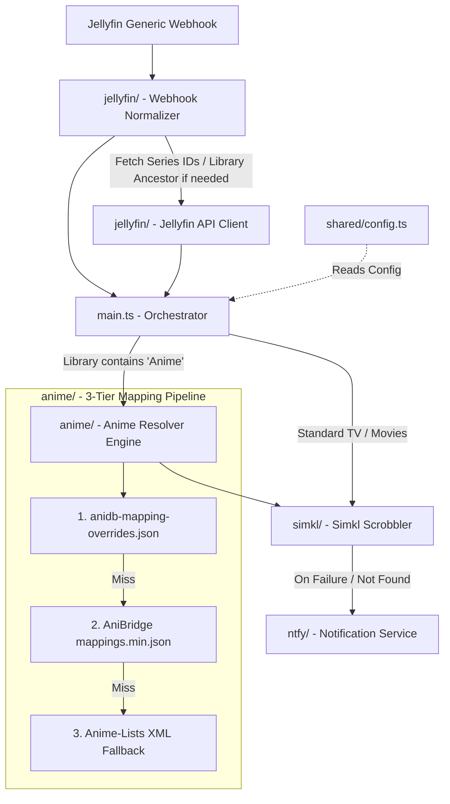

# jellyfin-simkl-sync

A lightweight, high-performance media sync webhook server built in TypeScript with Bun. It listens directly to Jellyfin playback webhook events, automatically routes between Anime (using AniBridge & AniDB cross-referencing) and standard TV Shows/Movies (using TVDB, TMDB, and IMDb IDs), and synchronizes watch history directly to your Simkl account.

It supports multi-user setups, sends scrobble failure notifications to a `ntfy` server, and is designed with a clean, decoupled service architecture.

---

## 🏛️ Architecture & Core Components



- **[index.ts](./index.ts)**: The HTTP entry point using `Bun.serve`. Initializes the anime mapping indices in the background and dispatches `/webhook` requests asynchronously to prevent Jellyfin timeouts.
- **[main.ts](./main.ts)**: The system orchestrator. Handles user credential verification, inspects library names, directs anime vs non-anime routing, delegates watch history logging to Simkl, and intercepts failures to send push notifications.
- **[anime/](./anime)**: The anime cross-referencing and mapping engine:
  - **Overrides** (`anidb-mapping-overrides.json`): User-configured overrides evaluated with top priority.
  - **AniBridge** (`mappings.min.json`): Fast, indexed bi-directional mappings translating TVDB/TMDB seasons into AniDB entries with support for continuous seasons, specials, multi-part ratios, and movies.
  - **Anime-Lists** (`anime-list-full.xml`): Community XML fallback for unplaced titles.
- **[jellyfin/](./jellyfin)**: Webhook normalizer and lightweight Jellyfin API client with in-memory caching to resolve series IDs and parent collection/library names if missing from the webhook payload.
- **[simkl/](./simkl)**: Simkl API scrobbler. Syncs completed watch events (>= 80% progress or marked played) with resolved AniDB IDs for anime, or TVDB/TMDB/IMDb IDs for non-anime media.
- **[ntfy/](./ntfy)**: Generates and posts failure notifications to `ntfy` server topics.
- **[shared/](./shared)**: Exposes typed configurations loaded dynamically from `config.toml` at startup.

---

## ✨ Features

- **Direct Jellyfin Webhook Ingestion**: Listens directly to Jellyfin's Generic Webhook destination.
- **Dual Pipeline (Anime & Non-Anime)**: Automatically identifies Anime libraries (libraries containing `"Anime"` case-insensitively, e.g. `"Anime"`, `"Anime Movies"`) and routes them through the AniDB mapping engine, while routing standard TV Shows and Movies directly via TVDB, TMDB, and IMDb IDs.
- **AniBridge Cross-Referencing**: Translates continuous TVDB season numberings into distinct AniDB anime entries and 1..N episode numbers automatically.
- **Custom Overrides**: Drop an `anidb-mapping-overrides.json` file in the root or config folder to fix or customize any anime mapping using the standard AniBridge schema.
- **Automated Background Refresh**: Periodically checks and hot-swaps expired mapping caches in the background every 24 hours without server restarts, and supports manual on-demand reloads via `POST /mappings/refresh`.
- **Strict Episode & Movie Scrobbling**: Only scrobbles media once playback finishes (reaching $\ge 80\%$ or marked played).
- **Multi-User Friendly**: Supports multi-user households by mapping different Jellyfin usernames directly to their respective Simkl tokens.
- **Failure Alerts via ntfy**: Sends clickable link alerts to your configured `ntfy` topic if a title is missing or unmapped in Simkl.

---

## 🛠️ Prerequisites

- **[Jellyfin](https://jellyfin.org/) 10.9.X+** with **Webhook plugin** (Generic destination configured to POST to `http://<bridge-host>:3000/webhook`)
- **[Simkl](https://simkl.com/) account**
  - **Client ID**: Register an application in the [Simkl Developer Console](https://api.simkl.org/api-reference/introduction).
  - **User Access Tokens**: Each user mapped in the application requires a Simkl Bearer Token.
- **[ntfy](https://ntfy.sh/) server** _(optional, skipped if omitted from config)_
- **[Bun Runtime](https://bun.sh/) 1.X** installed locally.

---

## 🚀 Getting Started

### 1. Installation

If you use [mise](https://mise.jdx.dev/) (recommended):

```bash
mise trust
mise install
```

Otherwise, install with Bun:

```bash
bun install
```

### 2. Configuration

Create a `config.toml` in the root of the project:

```toml
[jellyfin]
url = "http://YOUR_JELLYFIN_SERVER:8096"
token = "YOUR_JELLYFIN_API_KEY"

[simkl]
client_id = "YOUR_SIMKL_CLIENT_ID"
app_name = "jellyfin-simkl-sync"

[simkl.users]
jellyfin_username_1 = "SIMKL_USER_ACCESS_TOKEN_1"
jellyfin_username_2 = "SIMKL_USER_ACCESS_TOKEN_2"

[ntfy]
url = "https://ntfy.sh"
token = "YOUR_NTFY_AUTH_TOKEN"
topic = "YOUR_NTFY_TOPIC"
```

_Note: The `[jellyfin]` block is used to query series provider IDs (TVDB/TMDB) via Jellyfin's local API when they are not passed directly in the webhook payload._

### 3. Mapping Overrides (Optional)

You can place an `anidb-mapping-overrides.json` file in the root or configuration directory using the AniBridge format:

```json
{
  "anidb:665:O": { "tvdb_show:70873:s3": { "1-13": "1-13" } },
  "anidb:7777:R": { "tvdb_show:441190:s4": { "1-12": "1-12" } }
}
```

### 4. Running Locally

Start development server with live reload:

```bash
bun run dev
```

Or run in production mode:

```bash
bun start
```

---

## 🧪 Testing, Linting & Formatting

```bash
# Run unit tests
bun run test

# Lint code
bun run lint

# Format code
bun run format
```

---

## 🐳 Docker Setup

Build and run with Docker:

```bash
docker build -t jellyfin-anime-sync .

docker run -d \
  --name jellyfin-anime-sync \
  -p 3000:3000 \
  -v /path/to/config-dir:/config \
  jellyfin-anime-sync
```

---

## 📄 License

Distributed under the MIT License. See [LICENSE](./LICENSE) for more information.
