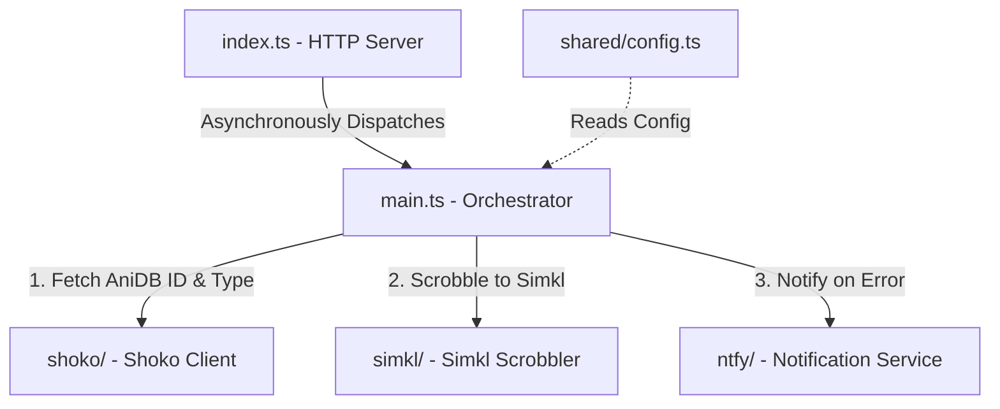

# Shoko Anime Sync (Bun version)

A lightweight, high-performance media bridging utility rewritten in TypeScript/Bun. It listens to Jellyfin media playback webhook events, queries your local Shoko Server to resolve AniDB metadata, and synchronizes watch history directly to your Simkl account.

It also supports multi-user setups, sends scrobble failure notifications to a `ntfy` server, and is designed with clean, decoupled service architecture.

---

## 🏛️ Architecture & Core Components

This application has been modularized with a strict separation of concerns:



- **[index.ts](./index.ts)**: The entry point using `Bun.serve`. It listens to POST requests on `/webhook` and immediately fires `handleWebhook` in the background (preventing HTTP timeouts from Jellyfin) while returning an early success response.
- **[main.ts](./main.ts)**: The system orchestrator (or mediator). It handles user credential verification, directs Shoko lookup, delegates watch history logging to Simkl, and intercepts failures to send push notifications.
- **[shoko/](./shoko)**: Handles Shoko Server API queries. Implements the episode/movie splitting logic (decided by whether TMDB returns a Movie mapping array of length 1) and handles special series episodes.
- **[simkl/](./simkl)**: Contains Simkl API interactions. Evaluates watch percentages (treating $\ge 80\%$ as completed/watched) and coordinates the history synchronization request.
- **[ntfy/](./ntfy)**: Generates and posts failure notifications to `ntfy` server topics.
- **[shared/](./shared)**: Exposes typed configurations loaded dynamically from `config.toml` at startup.

---

## ✨ What it does

- **Jellyfin Webhook Listener**: Listens directly to Jellyfin playback events so you don't have to trigger anything manually.
- **Smart Anime Metadata Matching**: Talks to your local Shoko Server behind the scenes to resolve AniDB IDs and figure out if you're watching a movie, a regular episode, or a special/ova/ona (which gets mapped to Season 0 automatically for Simkl).
- **Strict Episode Scrobbling**: Respects your watching progress—it will only scrobble series episodes to Simkl once you've actually finished watching them (hitting the 80% mark).
- **Multi-User Friendly**: Supports household setups by mapping different Jellyfin usernames directly to their respective Simkl tokens.
- **Failure Alerts via ntfy**: If a scrobble fails (like when Simkl is missing an AniDB mapping), it shoots an alert with a clickable AniDB link straight to your configured `ntfy` topic.

---

## 🛠️ Prerequisites

The following components and versions have been confirmed working:

- **[Jellyfin](https://jellyfin.org/) 10.11.X**
  - **[Shokofin](https://github.com/ShokoAnime/Shokofin) plugin 6.0.5.X** (for linking Jellyfin items to Shoko metadata)
  - **Webhook plugin 21.0.0.0** (for dispatching playback events)
- **[Shoko Server](https://shokoanime.com/downloads/shoko-server) 5.3.3**
  - Requires a Shoko API key (can be generated in the Shoko Admin Web UI)
- **[Simkl](https://simkl.com/) account**
  - **Client ID**: Register an application in the [Simkl Settings / Developer Console](https://api.simkl.org/api-reference/introduction) to obtain a Client ID.
  - **User Access Tokens**: Each user mapped in the application requires a Simkl Bearer Token (refer to the [Simkl OAuth Reference](https://api.simkl.org/api-reference/oauth)).
- **[ntfy](https://ntfy.sh/) server** \*
- **[Bun Runtime](https://bun.sh/) 1.X** installed locally.

_\* Optional: Failure notifications will be skipped if the `[ntfy]` block is not configured._

---

## 🚀 Getting Started

### 1. Installation

If you use [mise](https://mise.jdx.dev/) (recommended), the local Bun environment will be set up automatically:

```bash
# Trust the project configuration (required by mise for security)
mise trust

# Installs the configured Bun version and adds node_modules/.bin to your PATH
mise install
```

Otherwise, ensure you have [Bun](https://bun.sh/) installed globally, then run:

```bash
bun install
```

### 2. Configuration

Create a `config.toml` in the root of the project:

```toml
[shoko]
url = "http://YOUR_SHOKO_SERVER:8111"
token = "YOUR_SHOKO_API_KEY"

[simkl]
client_id = "YOUR_SIMKL_CLIENT_ID"
app_name = "shoko-anime-sync-bun"

[simkl.users]
jellyfin_username_1 = "SIMKL_USER_ACCESS_TOKEN_1"
jellyfin_username_2 = "SIMKL_USER_ACCESS_TOKEN_2"

[ntfy]
url = "https://ntfy.sh"
token = "YOUR_NTFY_AUTH_TOKEN"
topic = "YOUR_NTFY_TOPIC"
```

### 3. Running Locally

Start the server in development mode (with hot-reloading):

```bash
bun run dev
```

Or run it in production mode:

```bash
bun start
```

The server will listen for webhook requests on port `3000`.

---

## 🧪 Testing, Linting & Formatting

We use standard package scripts to test, lint, and format the application:

### Run Tests

```bash
bun run test
```

### Lint Code

Lint code with `oxlint`

```bash
bun run lint
```

### Format Code

Format all files in place using `oxfmt`:

```bash
bun run format
```

You can also run a check to verify formatting:

```bash
bun run format:check
```

---

## 🐳 Docker Setup

A Docker image can be built and deployed using the provided multi-stage `Dockerfile`.

### Build Image

```bash
docker build -t shoko-anime-sync-bun .
```

### Run Container

Make sure to mount your configuration directory containing `config.toml` to `/config` in the container:

```bash
docker run -d \
  --name shoko-anime-sync-bun \
  -p 3000:3000 \
  -v /path/to/your/config-dir:/config \
  shoko-anime-sync-bun
```

### Unraid

When setting up your Unraid container template, configure the volume mapping and port mapping as follows:

1. **Volume Mapping**:
   - **Container Path**: `/config`
   - **Host Path**: `/mnt/user/appdata/shoko-anime-sync-bun`
   - **Access Mode**: `Read/Write`

2. **Port Mapping**:
   - **Container Port**: `3000`
   - **Host Port**: `8282`
   - **Protocol**: `TCP`

Place your `config.toml` inside `/mnt/user/appdata/shoko-anime-sync-bun/` and start the container.

---

## 📄 License

Distributed under the MIT License. See [LICENSE](./LICENSE) for more information.
