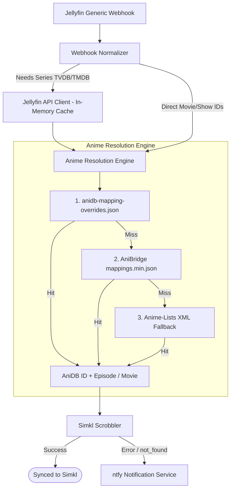

# Shoko Anime Sync - Webhook & Mapping Rewrite Plan

## 1. Overview & Goals

This project is transitioning from a Shoko Server-dependent bridge to an agnostic, direct Jellyfin webhook service.

### Key Objectives

1. **Deprecate Shoko Server Dependency**: Eliminate the dependency on a local Shoko Server instance.
2. **Direct Jellyfin Integration**: Ingest webhook events directly from Jellyfin's Webhook Plugin (`jellyfin-plugin-webhook`).
3. **Smart Anime Cross-Referencing**: Adopt the mapping approach used by `jellyfin-plugin-anidb`:
   - Prioritized 3-tier mapping pipeline:
     1. Local User Overrides (`anidb-mapping-overrides.json`)
     2. AniBridge Mappings (`anibridge/anibridge-mappings` schema v3)
     3. Anime-Lists XML Fallback (`Anime-Lists/anime-lists`)
   - Translate Jellyfin TVDB/TMDB seasons and episodes into distinct AniDB anime entries and 1..N episode numbers.
   - Translate Movie TMDB/IMDb/TVDB IDs to AniDB movie entries.
4. **Modernized Simkl Integration**: Port payload models and scrobble conventions from `jellyfin-plugin-simkl`:
   - Scrobble watched anime items (episodes and movies) with resolved `anidb` IDs.
   - Modular design supporting completion scrobbles (>= 80% on `PlaybackStop`) with hooks for future live scrobbling (`/scrobble/start`, `/scrobble/stop`).
5. **Future Non-Anime Extensibility**: Design the ingestion and scrobbler pipeline so non-anime media (standard TV shows and movies) can seamlessly pass through directly via TVDB/TMDB IDs in subsequent phases.

---

## 2. Architecture & Data Flow

---

## 3. Mapping Engine Specifications (Anime)

### A. AniBridge Schema (v3)

- Source: `https://github.com/anibridge/anibridge-mappings/releases/download/v3/mappings.min.json`
- Cached on local disk with TTL validation (7-day default).
- Structure:
  - Scope: `anidb:<animeId>:<kind>` where kind is `R` (Regular), `S` (Special), or `O` (Other).
  - Target:
    - TV shows: `"tvdb_show:<tvdbId>:s<seasonNumber>": { "<anidbRange>": "<tvdbRange>" }`
    - Movies: `"tmdb_movie:<id>": { "1": "1" }`, `"imdb_movie:<id>": { "1": "1" }`, `"tvdb_movie:<id>": { "1": "1" }`
  - Range syntax:
    - Exact: `"1-12": "1-12"`
    - Open-ended: `"13-": "13-"`
    - Comma-separated: `"1-6,8-13"`
    - Ratio weighting:
      - `"14-|2"`: 1 AniDB episode spans 2 TVDB episodes (e.g. multi-part episode).
      - `"1-2|-2"`: 2 AniDB episodes span 1 TVDB episode.

### B. Local Overrides (`anidb-mapping-overrides.json`)

- Evaluated with highest priority before any downloaded sources.
- Uses identical AniBridge schema format to allow direct pasting of community mapping definitions.

### C. Anime-Lists Fallback (`anime-list-full.xml`)

- Source: `https://raw.githubusercontent.com/Anime-Lists/anime-lists/master/anime-list-full.xml`
- Provides fallback for titles not yet present in AniBridge.
- Maps `<anime anidbid="..." tvdbid="..." defaulttvdbseason="..." episodeoffset="...">`.

---

## 4. Webhook & Jellyfin Integration

### Jellyfin Generic Webhook Quirks

- Episode events from `jellyfin-plugin-webhook` contain the episode's own provider IDs (`Provider_tvdb`, etc.), but **not** the series's TVDB/TMDB ID.
- The webhook payload does include `SeriesId` (Jellyfin internal GUID) and `SeriesName`.
- Solution:
  - If series provider IDs are provided in the payload (custom template / movie), use directly.
  - Otherwise, query Jellyfin's local API (`GET /Items/{SeriesId}`) using configured API key, caching the series provider IDs in memory.

---

## 5. Implementation Phases

### Phase 1: AniBridge & Override Mapping Engine (COMPLETED)

- [x] `anime/range.ts`: Parse AniBridge ranges, spans, and ratio weights (`1-12`, `14-|2`, `1-2|-2`).
- [x] `anime/cache.ts`: Cache manager for `mappings.min.json` and `anime-list-full.xml` with local disk storage and TTL.
- [x] `anime/anibridge.ts`: In-memory AniBridge indexing (TVDB show/season $\rightarrow$ AniDB spans; movie IDs $\rightarrow$ AniDB movie ID).
- [x] `anime/animelist.ts`: Secondary fallback indexer from Anime-Lists XML.
- [x] `anime/overrides.ts`: Loader for `anidb-mapping-overrides.json`.
- [x] `anime/resolver.ts`: Unified resolver resolving episodes and movies.
- [x] `anime/resolver.test.ts`: Comprehensive test suite verifying standard shows, split cours, specials, movies, and overrides.

### Phase 2: Webhook Normalization & Jellyfin Ingestion (COMPLETED)

- [x] `jellyfin/client.ts`: Jellyfin API client with in-memory caching for `SeriesId` $\rightarrow$ provider IDs.
- [x] `jellyfin/normalizer.ts`: Normalizer converting Jellyfin webhooks into standardized `NormalizedPlaybackEvent`.
- [x] `jellyfin/normalizer.test.ts`: Unit tests for webhook parsing and completion detection.

### Phase 3: Simkl Scrobbler & Shoko Deprecation (COMPLETED)

- [x] `simkl/simkl.ts`: Update Simkl scrobbler based on `jellyfin-plugin-simkl` principles (scrobbling resolved AniDB IDs).
- [x] Deprecate & remove `shoko/` directory and legacy `shared/payload.ts`.
- [x] Update `shared/config.ts` and `config.toml` (remove `[shoko]`, add optional `[jellyfin]`).
- [x] Update `main.ts` orchestrator and end-to-end integration tests in `main.test.ts`.

### Phase 4: Non-Anime Media Support (COMPLETED)

- [x] Route non-anime media directly to Simkl using TVDB/TMDB/IMDb IDs via `scrobbleStandardEpisode` and `scrobbleStandardMovie`.
- [x] Library name based routing: libraries containing `"Anime"` (case-insensitive) route to the AniDB cross-reference engine; other libraries route to the standard non-anime pipeline.
- [x] Jellyfin API ancestor lookups (`/Items/{id}/Ancestors`) to resolve library name when not supplied in webhook payload.
- [x] Comprehensive integration tests in `main.test.ts` covering non-anime TV shows (e.g. _Breaking Bad_), non-anime movies (e.g. _Inception_), and fallback handling.
